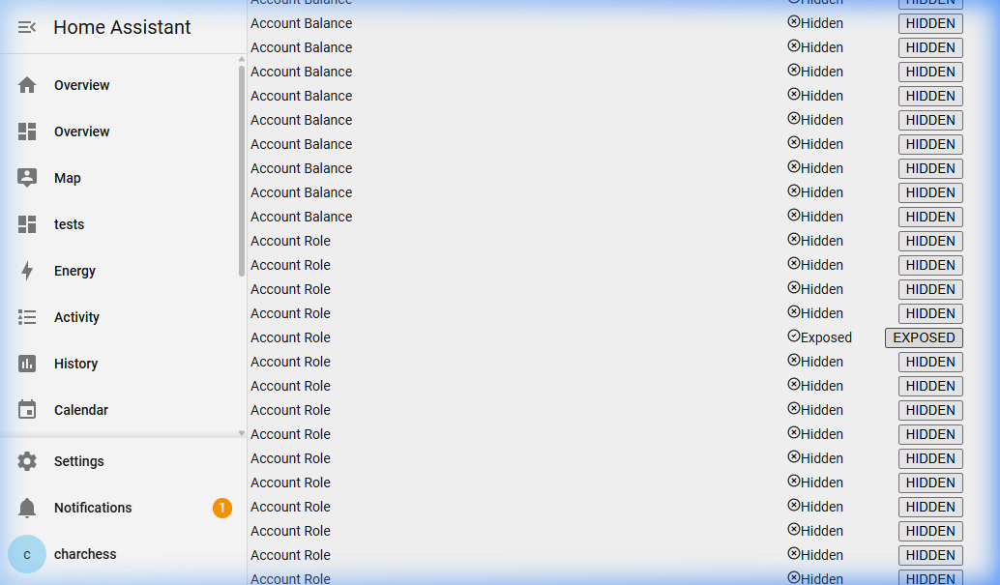

# GAIA - Google Assistant Integration Administrator

GAIA provides a modern, dedicated React dashboard inside Home Assistant to manage which of your devices and entities are exposed to Google Assistant.

**Important Note:** GAIA is a UI management layer. It requires the official Home Assistant `google_assistant` component to be configured in your `configuration.yaml` in order to actually sync the devices to Google.

## What It Does

Instead of manually typing out `entity_id` lists or navigating complex YAML configurations to hide/expose devices to Google Assistant, GAIA gives you a beautiful web interface to:
- **Set Domain Defaults:** Choose whether entire domains (like all your `light` or `switch` entities) are exposed or hidden by default.
- **Manage Individual Exceptions:** Quickly toggle specific entities on or off, creating exceptions to your global domain rules.

## Features

- **Beautiful React Dashboard**: Clean "glassmorphism" UI with dark/light mode support.
- **Dynamic Inventory**: Automatically groups your entities by domain using a wrapping tab grid with official `lucide-react` icons.
- **Global Domain Overrides**: Set an entire domain to "EXPOSE" or "HIDE" by default using the massive blue toggle switch.
- **One-Click Exceptions**: Use the custom-built, physical-styled text toggles to create individual exceptions for each entity.
- **Live Search & Filter**: Easily find the exact entity you want to expose or hide.

## Installation 

### Method 1: HACS (Highly Recommended)

GAIA is designed to be installed seamlessly via HACS (Home Assistant Community Store).

1. Open **HACS** in your Home Assistant instance.
2. Go to **Integrations**, click the three dots in the top right corner, and select **Custom repositories**.
3. Add the repository URL `https://github.com/charchess/GAIA` and select **Integration** as the category.
4. Click **Add**, then search for "GAIA" and click **Download**.
5. Restart Home Assistant.
6. Go to **Settings > Devices & Services > Add Integration**, search for "GAIA", and configure it.
7. The GAIA Exposure panel will appear in your left sidebar!

### Method 2: Manual Installation
If you do not use HACS, you can download the repository as a ZIP, extract the `custom_components/gaia` folder, and place it directly inside your Home Assistant `custom_components/` directory. Then, restart and add the integration via the Settings UI.
